# Основы оркестрации контейнеров

Использование инструментов docker compose и docker swarm для совместного запуска контейнеров и их простейшей оркестрации.


## Part 1. Запуск нескольких docker-контейнеров с использованием docker compose

**== Задание ==**

1) Написать Dockerfile для каждого отдельного микросервиса. Необходимые зависимости описаны в материалах. В отчете отобразить размер собранных образов любого сервиса различными способами.

<br/> 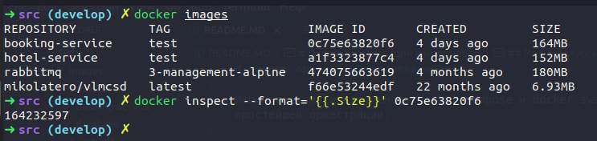

2) Написать docker-compose файл, который осуществляет корректное взаимодействие сервисов. Пробросить порты для доступа к gateway service и session service из локальной машины. Помощь по docker compose в материалах.

```
version: "3.8"
services:
  db:
    build: "./services/database"
    env_file:
      - ./services/database/.env.db
    volumes:
      - data:/var/lib/postgresql/data
  rmq:
    image: "rabbitmq:3-management-alpine"
  booking:
    build: "./services/booking-service"
    env_file:
      - ./services/booking-service/.env.booking
    depends_on:
      - payment
      - hotel
      - rmq

  gateway:
    build: "./services/gateway-service"
    ports:
      - 8087:8087
    env_file:
      - ./services/gateway-service/.env.gateway
    depends_on:
      - booking
      - hotel
      - loyalty
      - session
  hotel:
    build: "./services/hotel-service"
    env_file:
      - ./services/hotel-service/.env.hotel
  loyalty:
    build: "./services/loyalty-service"
    env_file:
      - ./services/loyalty-service/.env.loyalty
  payment:
    build: "./services/payment-service"
    env_file:
      - ./services/payment-service/.env.payment
  report:
    build: "./services/report-service"
    env_file:
      - ./services/report-service/.env.report
    depends_on:
      - rmq
  session:
    build: "./services/session-service"
    ports:
      - 8081:8081
    env_file:
      - ./services/session-service/.env.session

volumes:
  data:

```

3) Собрать и развернуть веб-сервис с помощью написанного docker compose файла на локальной машине.
<br/> 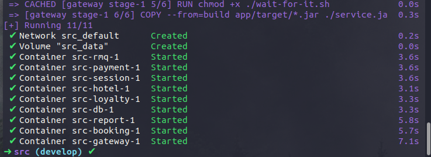

4) Прогнать заготовленные тесты через postman и удостовериться, что все они проходят успешно. 
<br/> 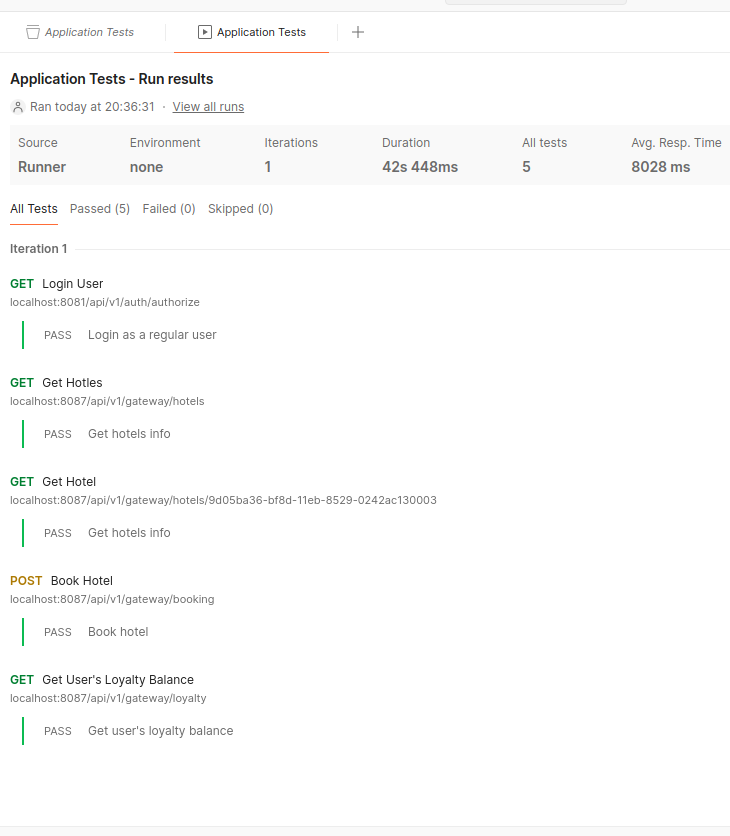

## Part 2. Создание виртуальных машин

Пришло время заготовить основу для будущих узлов кластера. Создадим виртуальную машину.

**== Задание ==**

1) Установить и инициализировать Vagrant в корне проекта. Написать Vagrantfile для одной виртуальной машины. Перенести в виртуальную машину исходный код веб-сервиса в рабочую директорию виртуальной машины.
```
ENV['VAGRANT_SERVER_URL'] = 'https://vagrant.elab.pro'
Vagrant.configure("2") do |config|
  config.vm.box = "ubuntu/focal64"
  config.vm.network "forwarded_port", id: "ssh", guest: 22, host: 2223
  config.vm.hostname = "part2"

  project_folder = File.expand_path("../src", __FILE__)
  config.vm.synced_folder project_folder, "/vagrant/src"

  config.vm.provision "shell" do |s|
    ssh_pub_key = File.readlines("#{ENV['USERPROFILE']}/.ssh/id_rsa.pub").first.strip
    s.inline = <<-SHELL
    echo #{ssh_pub_key} >> /home/vagrant/.ssh/authorized_keys
    echo #{ssh_pub_key} >> /home/vagrant/.ssh/authorized_keys
    cp -r /vagrant/src /home/vagrant/
    SHELL
  end

  config.vm.provider "virtualbox" do |vb|
    vb.name = "part2"
    vb.memory = "2048"
    vb.cpus = 1
  end
end
```

2) Зайти через консоль внутрь виртуальной машины и удостовериться, что исходный код встал куда нужно. Остановить и уничтожить виртуальную машину.

Запуск Vagrant
 <br/> 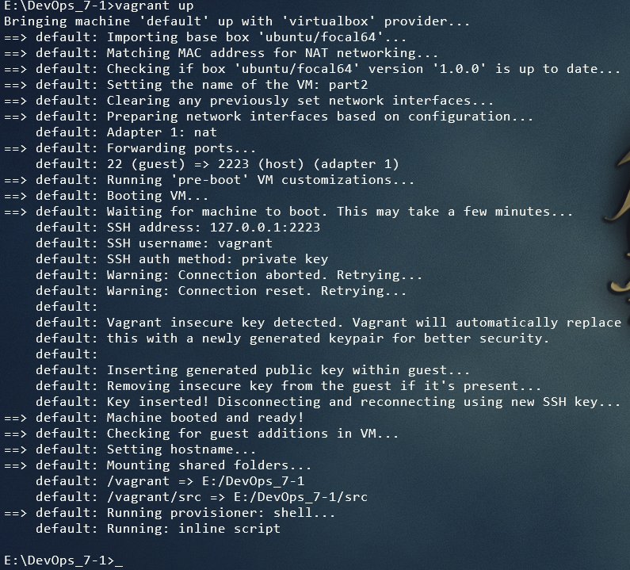

Проверка, что папка скопировалась <br/> 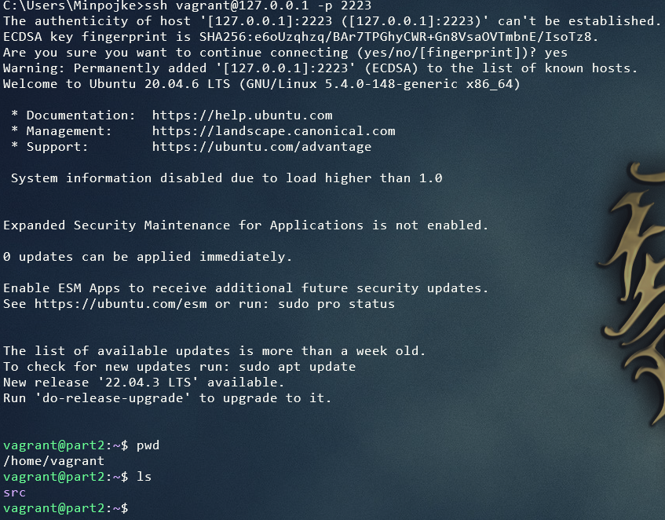

## Part 3. Создание простейшего docker swarm

Ну вот и пришло время создания твоего первого docker swarm!

**== Задание ==**

1) Модифицировать Vagrantfile для создания трех машин: manager01, worker01, worker02. Написать shell-скрипты для установки docker внутрь машин, инициализации и подключения к docker swarm. Помощь с docker swarm материалах.

2) Загрузить собранные образы на docker hub и модифицировать docker-compose файл для подгрузки расположенных на docker hub образов.

<br/> 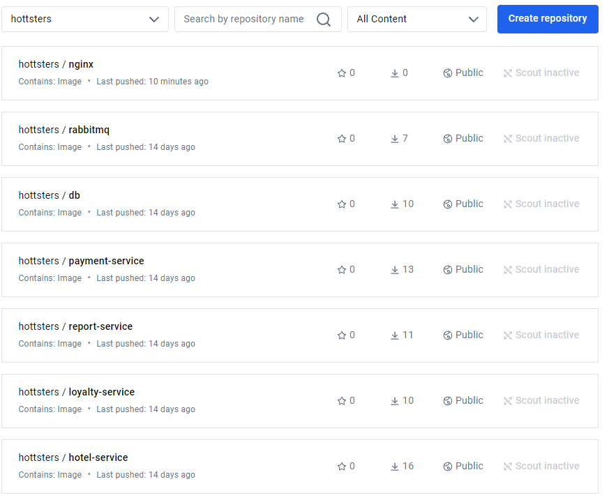

3) Поднять виртуальные машины и перенести на менеджер docker-compose файл. Запустить стек сервисов, используя написанный docker-compose файл.

<br/> 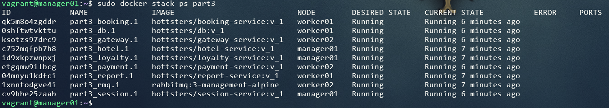

4) Настроить прокси на базе nginx для доступа к gateway service и session service по оверлейной сети. Сами gateway service и session service сделать недоступными напрямую.

Удаляем проброс портов напрямую session и gateway.

Конфиг nginx
```
events {}
http {
    upstream session {
        server session:8081;
    }

    upstream gateway {
        server gateway:8087;
    }
    server {
        listen 8081;
        location ~ (/) {
            proxy_pass http://session;
        }
    }
    server {
        listen 8087;
        location ~ (/) {
            proxy_pass http://gateway;
        }
    }
}
```
Пробрасываем порты на manager01

<br/> 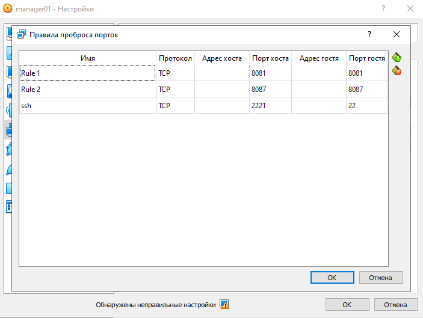

5) Прогнать заготовленные тесты через postman и удостовериться, что все они проходят успешно. В отчете отобразить результаты тестирования.

<br/> 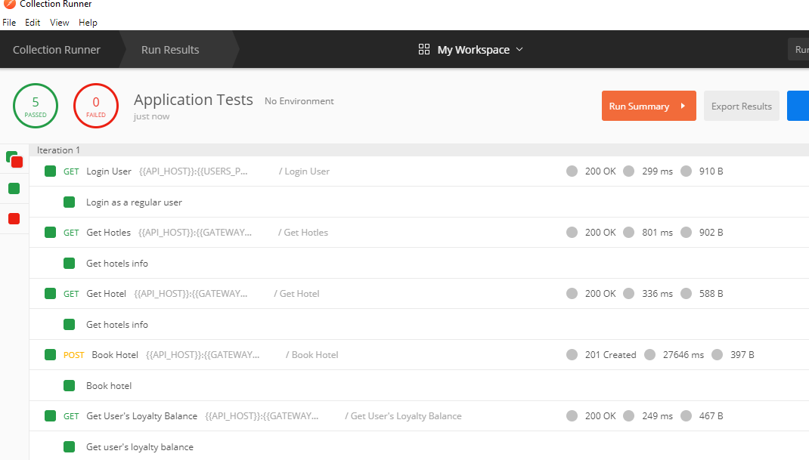

6) Используя команды docker, отобразить в отчете распределение контейнеров по узлам.

<br/> 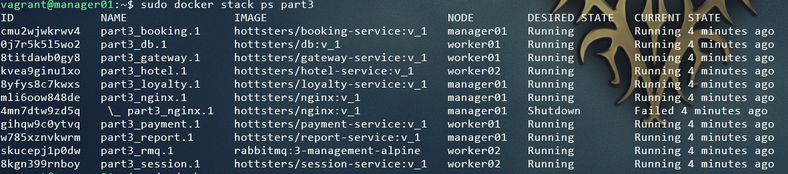

7) Установить отдельным стеком Portainer внутри кластера. В отчете отобразить визуализацию распределения задач по узлам с помощью Portainer.

Запускаем portainer
<br/> 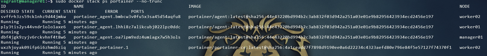

Визуализация
<br/> 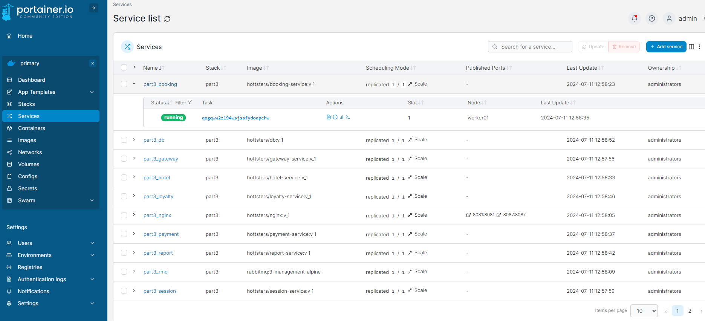

<br/> 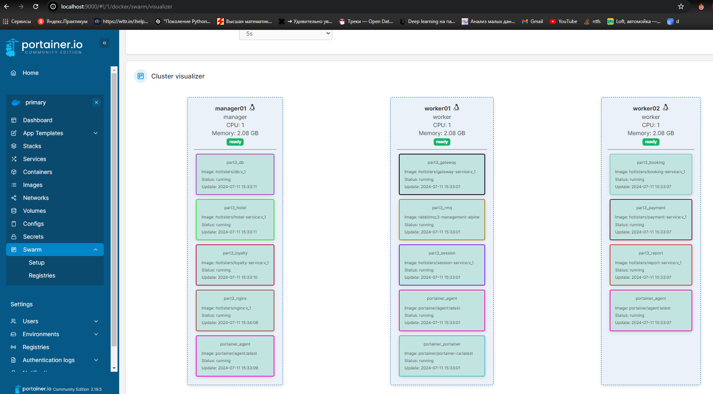